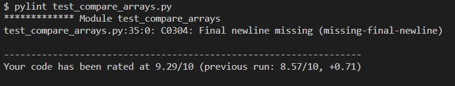
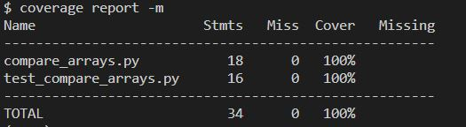

Unit-тесты 
Домашнее задание 6

## Отчет pylint

## Отчет о покрытии тестами

Пояснения:
покрыты тестами ситуации:
- на вход пришел не список (один или оба)
- на вход пришел пустой список (один или оба)
- первый список имеет большее среднее значение
- второй список имеет большее среднее значение
- средние значения списков равны
Тестами проверяется корректность вывода сообщения результата сравнения списков,
выброс исключения если передан не список. Пустой список равен 0.

pip install pytest
pip install coverage
pip install pylint
coverage run -m pytest test_Tasks.py
coverage report -m
pylint Tasks